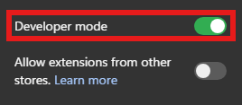
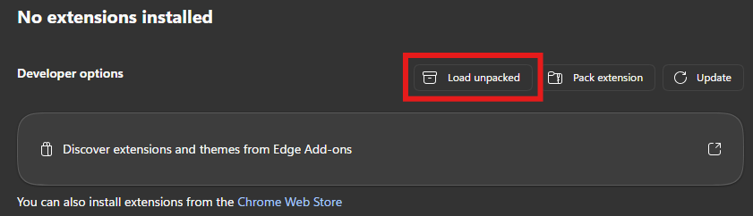
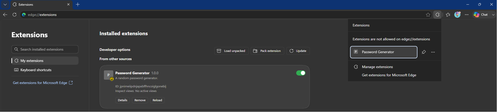
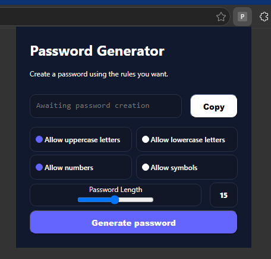

# Password Generator (Chromium Extension)

To install this extension, please visit one of the following URLs, depending on your browser:
- `chrome://extensions` (Chrome)
- `edge://extensions/` (Edge)
- `about:addons` (Firefox)

If your browser is not listed above, it does not necessarily mean that you cannot use this extension.
Check whether your browser supports Chromium; if it does, you can install and use this extension.
Look in your settings to access your extensions.

# How to install the extension:
Step 1: enable "Developer mode"

Step 2: Load the extension

The extension is now installed on your browser.

You can now click on it to use it.

You are free to modify the extension as you wish. The original extension might receive updates in the future.